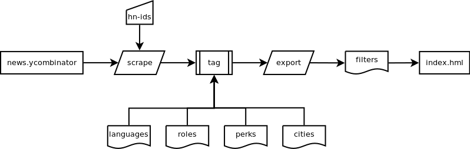

# HN-hiring-dashboard
A simple dashboard based on Hacker News' _Who is hiring_ posts. The simple scraper python file download and parse the html text, then a tagging process try to identify common aspects of the post (cities, programming languages, roles, perks) and export the result as a csv file ready to be rendered as a simple vue.js application.

The _index.html_ file renders some filters and dc.js charts from the _filters.csv_ datasource. A simple _elasticlunr.js_ index is used to provide basic full text search. Maybe a digram would help to illustrate the idea:



## Installation

The python dependencies can be installed using _pip_:

```
pip install -r requirements.txt
```

to run the scraper and generate a valid _filters.csv_ file from the January, February and March (2018) posts:

```
python hn_hiring_scraper.py 16052538 16492994 16282819
```

### The tags sources

To tag each post some static lists are included:
- Programming languages from [Tiobe index](https://www.tiobe.com/tiobe-index/) (consulted march 2018)
- Cities from [WorldAtlas](https://www.worldatlas.com/citypops.htm)
- IT Roles from [The Balance](https://www.thebalance.com/list-of-information-technology-it-job-titles-2061498) with some Data Science additions

### Why is not \[R, C++, C#, etc\] included in the filters?

Currently the auto-tagging process is very simple and cannot tag properly all the posts, but you can use the full text search to find and filter some of them (_Try c# in the search box for example_). I am working on that...no promises.

## TODO

- Document the code and improve README.md fle
- Optimize js imports (_why dc.min.js breaks the rowChart order?_)
- Improve post rendering
- Add topic analysis to the scraper and to the filters
- Add _undo search_
- Improve performance
- Improve auto-tagging
- Improve duplicate detection
- Improve dc dimensions to include multiple languages/cities/roles
